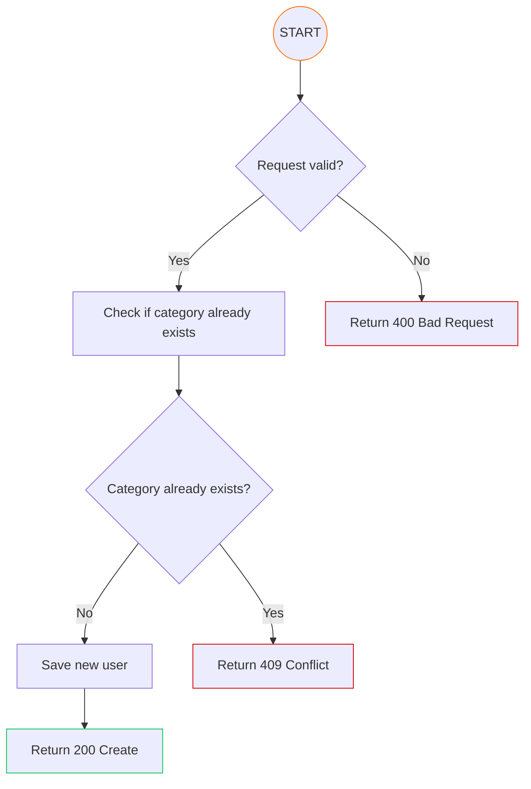

# API-CoreData

#### This API will handle all CashFlow core data functions.
#### You can check the OpenAPI documentation [here](https://peralta-cashflow.github.io/CashFlow-API-CoreData/).

#### All the authentication process is done by JWT tokens which are generated and sent to front-end when the user logs in. The token will be validated on every request to every API by an interceptor implemented on the [Auth-Lib](https://github.com/Peralta-CashFlow/CashFlow-Libraries/tree/main/Auth-Lib)

# Summary

- [Category](#category)
  - [Registration](#category-registration)
- [Containerization](#containerization)
- [Observability](#observability)
- [Environment Variables](#environment-variables)

# Category

This is the base CashFlow data responsible for, as it's name says, categorization of expenses and incomes making it easier 
to track and organize your financial life.

## Category Registration

To register a new category, you need to provide the following information:

- **name**: Category name;
- **color**: The color in HEX format (optional);
- **icon**: An icon that refers to the category (optional);
- **type**: The type of the category ('E' for expense and 'I' for income);

The system will validate the information received to check if all data is valid and if the 
category does not already exists.

### Endpoint

`[POST] /api/core/category`

### Flowchart

# Containerization

To run the API in a containerized environment, you can use Docker. Access this [DockerHub](https://hub.docker.com/r/viniciusperalta/cashflow-api-core-data)
repository that contains the Docker image for this API, you can pull the image and run it.

If you want, clone this [repository](https://github.com/Peralta-CashFlow/CashFlow-Compose) where we have a
Docker Compose file that will run all CashFlow environment locally! Checkout the documentation on the repository.

# Observability

This API is configured to expose metrics and traces for observability purposes with [Prometheus](https://prometheus.io/)
also on the Docker Compose file mentioned above, it is integrated with [Grafana](https://grafana.com/).
Reefer to the Organization's documentation for more details about observability.

# Environment Variables

- DATABASE_CONNECTION_STRING;
- DATABASE_USERNAME;
- DATABASE_PASSWORD;
- APP_CROSS_ORIGIN;
- SERVER_PORT;
- JWT_SECRET;